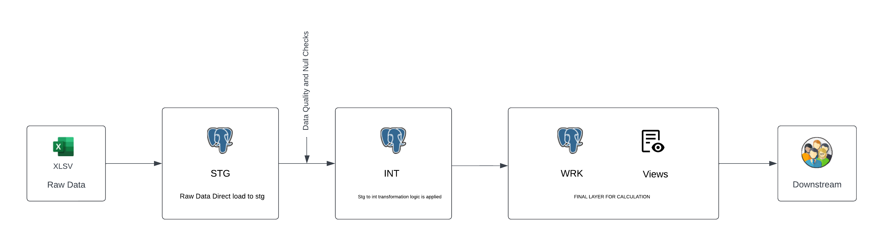

## Your One-Stop Destination for Managing Budgets and Gaining Financial Insights

This project provides tools and reports to help users analyze their spending, savings, and investments, allowing for more informed financial decisions.

### Business Insights Generated from the Monthly Reports

1.   **Savings Rate**
2.   **Recurring vs Non-Recurring**
3.   **Expense Efficiency**
4.   **Highest Daily Expense**
5.   **Lowest Daily Expense**
6.   **Weekly Expense Analysis**
7.   **Unexpected Expenses**
8.   **Daily Spending Variance**
9.   **Opportunity Cost Analysis**
10.   **Psychological Spending**
11.   **Needs, Wants, and Investments**
12.   **Pending Payments**
13.   **1st 15 Days vs Last 15 Days**
14.   **Max Expense Category**
15.   **Top N Expense Categories**
16.   **Weekdays vs Weekends**
17.   **Category-wise Distribution by Day Type**

### Data Flow Diagram



### Standard Operating Procedure (SOP) for Running the Code

1. **DDL and Data Load Excel to STG:**  
   ```bash
   python -u "path\script.py"

2. **Data Load STG to INT:**
   ```bash
   python data_load.py finance_insights_stg finance_insights_int month_year

3. **Data Load INT to WRK:**
   ```bash
   python data_load.py finance_insights_int finance_insights_wrk month_year
4. **Generate Reports using the commands provding month and year as arguments :**
   ```bash
   python Generate_insights.py --month september --year 2024
